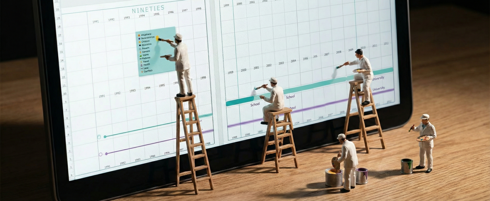

<div align="center">

# ⏳ LifeLine

**See your entire life on paper — from birth to horizon**

[](https://lifeline.osovsky.com)
[](LICENSE)

A browser-based tool that generates multi-decade life timelines with a Gantt-style grid for personal events. Add milestones, export to PDF, print on large format paper.

**Zero dependencies · No login · 100% private**



</div>

---

## 💡 Concept

> Lines and structures are a language for making sense of your life — just as a blueprint is the language of an engineer, a map is the language of a geographer, a Gantt chart and org chart are the language of a manager, BPMN is the language of IT, and a timeline is the language of a historian.

### Purpose

- **🔍 Life Tracking** — visualize key events across decades (1971–2070). Categories: Happiness, Relationships, Children, Education, Career, Income, Travel, Hobbies, Sport, Health, Loss, Conflicts
- **🪞 Self-reflection** — see your entire life from a bird's-eye view, discover patterns, assess achievements
- **🎯 Goal setting** — plan the future by marking desired milestones on upcoming years
- **🎨 Decorative** — aesthetic templates for bullet journals, planners, and scrapbooks

### Target Audience

- **Self-developers & planners** — personal growth, time management, and visual life tools
- **Journal & planner enthusiasts** — beautiful templates for bullet journals and scrapbooking
- **Coaches & psychologists** — life timelines for resource analysis and long-term goal setting
- **Mid-life & senior adults** — retrospective analysis and life planning

## ✨ Features

| Feature | Description |
|---------|-------------|
| **Decades at a glance** | Past and future years on a scrollable multi-page canvas |
| **Paper formats** | A4 (multi-page) and ×4 (914mm roll, 4 copies) |
| **Column width** | 1cm, 1.5cm, or 2cm per year column |
| **Gantt rows** | 10 or 14 rows for life categories |
| **Custom entries** | Add events like `3, Product launch, 2018` or bars `4, 1979-1990, School, blue` |
| **Life milestones** | Eurostat avg: dual ♀/♂ lines with education bars, SVG icons, head silhouettes |
| **PDF & SVG export** | Embedded IBM Plex Sans fonts, parallel font loading |
| **Sticky note** | Draggable 12-category cheatsheet in Tiffany blue |
| **Mobile-first** | Bottom bar with year range, paper toggle, settings sheet |
| **Touch gestures** | Pan, pinch-to-zoom, touch-drag for sticky note |
| **Private** | All data in localStorage, never leaves your browser |
| **Zero dependencies** | No npm, no framework, pure vanilla JS |

## 🚀 Quick Start

```bash
npx -y serve -l 3456
# Open http://localhost:3456
```

Or visit the live version:
- [lifeline.osovsky.com](https://lifeline.osovsky.com)
- [osovsky.com/lifeline](https://osovsky.com/lifeline/) — via gateway

## 🎛️ Controls

### Desktop

| Control | Action |
|---------|--------|
| **Hindsight / Foresight** | Start/end year (type or scroll wheel) |
| **1 / 1.5 / 2** | Column width (cm) |
| **A4 / ×4** | Paper format |
| **10 / 14** | Number of Gantt rows |
| **Life-button** (favicon) | Add entry modal |
| **⬇ SVG / 🖨 PDF** | Export |
| **Mouse wheel** | Zoom in/out |
| **Click + drag** | Pan canvas |

### Mobile

| Control | Action |
|---------|--------|
| **1991–2051** | Year range display |
| **A4** (square button) | Paper format toggle |
| **Favicon** (center) | Add entry |
| **⬇** | SVG/PDF popup |
| **⚙** | Settings sheet (years, format, rows, column width) |

## 📝 Adding Entries

1. Click the **Life-button** (favicon icon)
2. Type one entry per line:
   ```
   3, Product launch, 2018
   5, Started MBA, 2020
   4, 1979-1990, School, lightblue
   5, 1990-1995, University, blue
   ```
3. Click **Add** — all entries saved at once

**Formats:**
- Point entry: `row, text, year`
- Bar range: `[row,] YYYY-YYYY, text [, color]`
- Colors: any CSS name (`red`, `blue`, `salmon`) or hex (`#FF6B6B`)

Entries persist in `localStorage` across sessions.

## 🏗️ Tech Stack

| File | Purpose |
|------|---------|
| `calendar.js` | SVG renderer, viewport, pan/zoom, export, i18n |
| `style.css` | Tiffany blue mobile theme, responsive layout |
| `index.html` | App shell + GA4 events (`export_svg`, `export_pdf`, `add_entry`, `toggle_milestones`) |
| `fonts/` | IBM Plex Sans (Light, Regular, Bold) |

See [ARCHITECTURE.md](ARCHITECTURE.md) for full technical details and [MANUAL.md](MANUAL.md) for the user guide.

## 📚 Publications & Lectures

<details>
<summary>📖 Articles about #lifelines methodology</summary>

- [Lifelines](https://t.me/maximosowski/382) · [Ladder of Life](https://t.me/maximosowski/383) · [Lifelines-2](https://t.me/maximosowski/384) · [Lifelines-3](https://t.me/maximosowski/385) · [Template](https://t.me/maximosowski/388)
- [Family Connections](https://t.me/maximosowski/394) · [13 Generations](https://t.me/maximosowski/397)
- [Academic Genealogies](https://t.me/maximosowski/399) · [Netmaps](https://t.me/maximosowski/402) · [Org Structures](https://t.me/maximosowski/403)
- [How to Draw a Vision of the Future](https://t.me/maximosowski/411) · [Expanding Planning Horizons](https://osowski.medium.com/calendar-392272c97af3) · [Timeline Calendar](https://t.me/maximosowski/174)
- [Шаблон «Линии жизни»](https://osovsky.medium.com/%D1%88%D0%B0%D0%B1%D0%BB%D0%BE%D0%BD-%D0%BB%D0%B8%D0%BD%D0%B8%D0%B8-%D0%B6%D0%B8%D0%B7%D0%BD%D0%B8-1a2e5c978e22) (Medium)

</details>

<details>
<summary>📹 Lectures & Seminars</summary>

- [Lifeline. Schematization](https://t.me/maximosowski/216) (Cheboksary, 2019)
- [Career Development of a Top Manager](https://t.me/maximosowski/172) (Sochi, 2018)
- [Lifeline. How Was It?](https://t.me/maximosowski/201) (PiR, 2018)
- [Lifeline & Schematization in Coaching](https://t.me/maximosowski/183) (Seminar, 2018)
- [Images of the Future & Graphic Thinking](https://t.me/maximosowski/114) (Kirov, 2017)
- [Forum of Ideas](https://t.me/maximosowski/266) (Moscow, 2020)

</details>

## 📄 License

[Maxim Osovsky](https://www.linkedin.com/in/osovsky/). Licensed under [MIT](LICENSE).
